# Environment installation

## Ubuntu 22.04
Refer to [this guide](https://ubuntu.com/tutorials/install-ubuntu-desktop) by Ubuntu Software to install.  
Link to download Ubuntu: [click here](https://ubuntu.com/download/desktop)  


### Update Ubuntu package
- First and foremost, before installing anything in the instructions below, you need to update your Ubuntu package to the lastest version by using two command (no images because it is very large to capture for the first time executing this command):  
```shell
sudo apt update && sudo apt upgrade
```

## MySQL 8.0
- Step 1: Finding mysql-server package by using command:
```shell
apt-cache search mysql-server
```
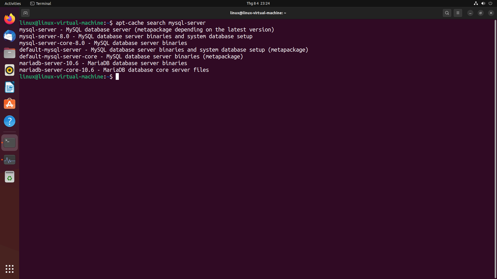  
We will using package ***mysql-server-8.0*** for this course.
- Step 2: Install ***mysql-server-8.0*** package using command:
```shell
sudo apt install mysql-server-8.0
```

*Note*: If it show in the first time *'[sudo] password for [username]:'*, just type in your Ubuntu password when install.
- Step 3: Setup MySQL root password  
    + First, we run the command to access MySQL console: 
    ```shell
    sudo mysql
    ```
    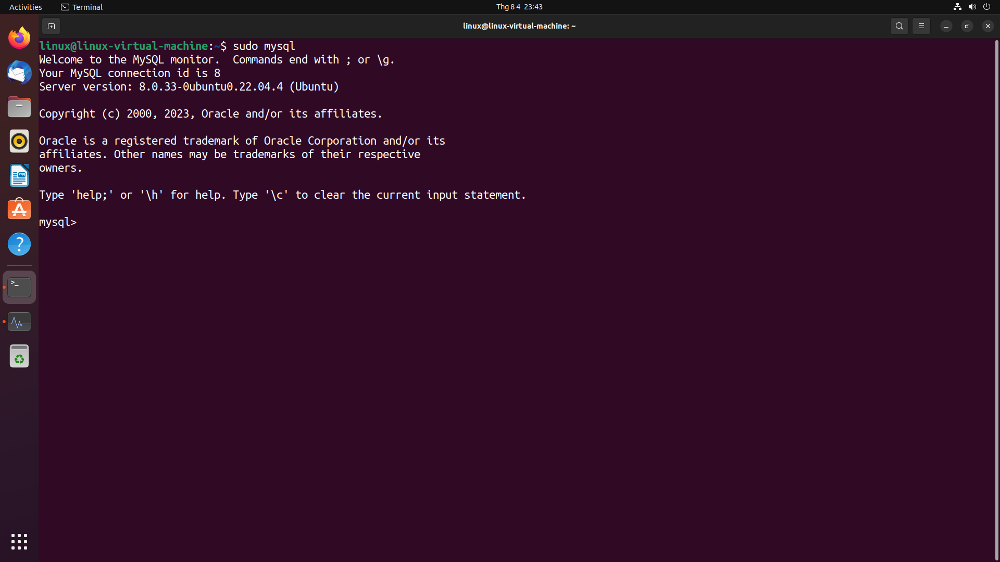
    + Next, we will set the MySQL root password by using this command in MySQL console:  
    ```mysql
    ALTER USER 'root'@'localhost' IDENTIFIED WITH mysql_native_password BY 'your_password';
    ```
    DO change ***your_password*** to your specific password, because you will need to remember it (or if you create another user, remember it in case you want to change password or something, idk :|)  
    In my case, I will change root password to ***Password1@***.
    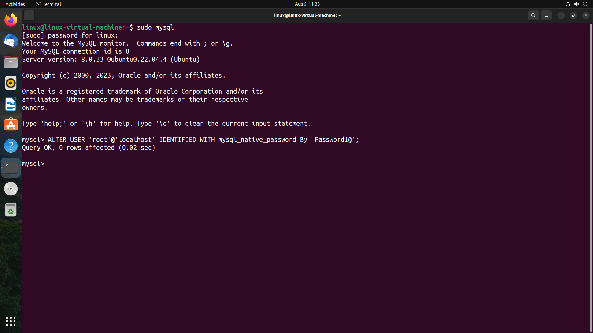
    If it show `QUERY OK, 0 rows affected.`, that mean you have changed your root password.
    + Exit the MySQL console and return to shell command to go to next step:
    ```mysql
    exit
    ```
    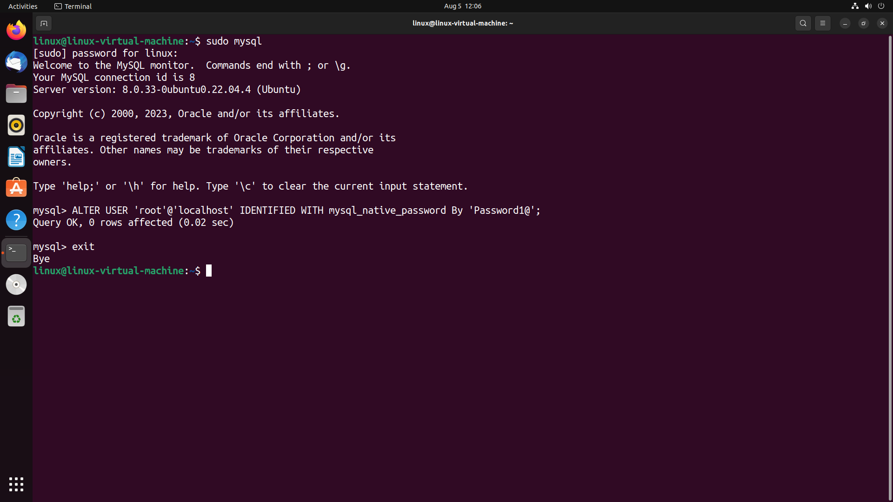
- Step 4: Setup MySQL installation
    + After go back to shell command (notice the directory of the line your cursor currently at), type in: 
    ```shell
    sudo mysql_secure_installation
    ```
    to execute MySQL Secure Installation.

      

    + Type in your MySQL root password set in the above step:

    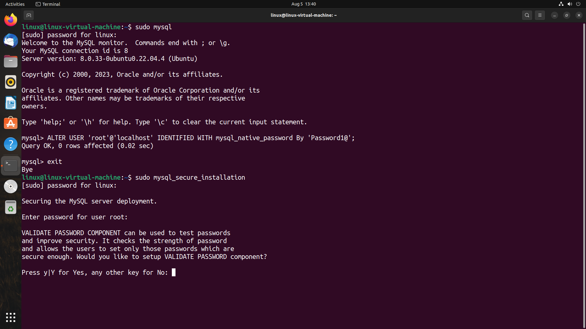
    You will see MySQL asking for validate password component if you rype in your password correctly.

    + We will use the validate component, so enter 'y' and continue:

    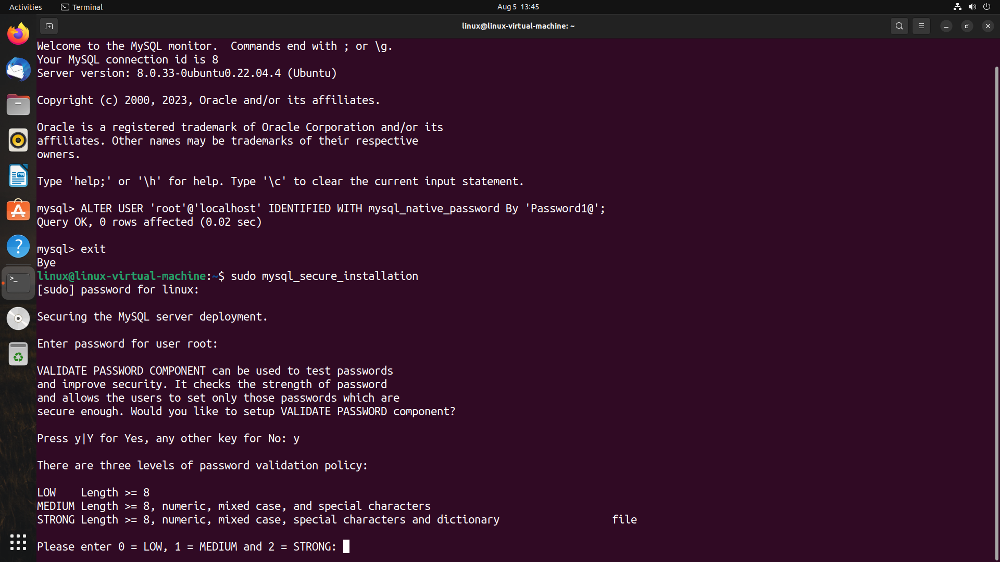

    + For this case, we will using level 1, which is medium. Type in '1' and continue:

    

    + Because we have install our root password before, we will skip the change root password part. Type in 'n' for no and continue.

    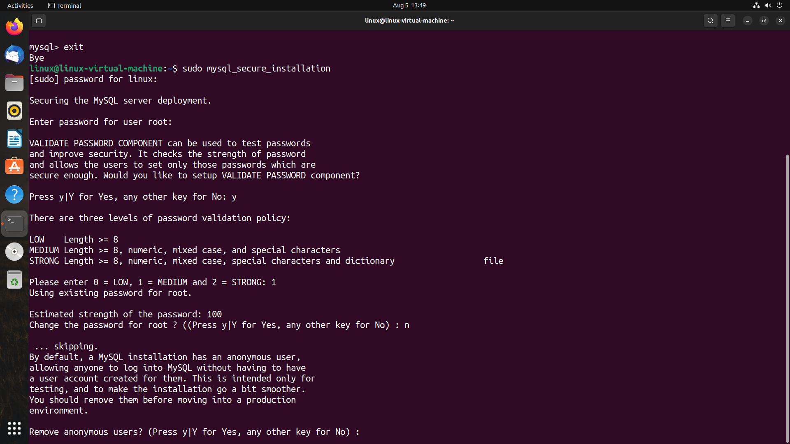

    + We are not in production environment, so remove anonymous users is not needed. Therefore, we will not remove anonymous user in this step. Type in 'n' for no and continue.

    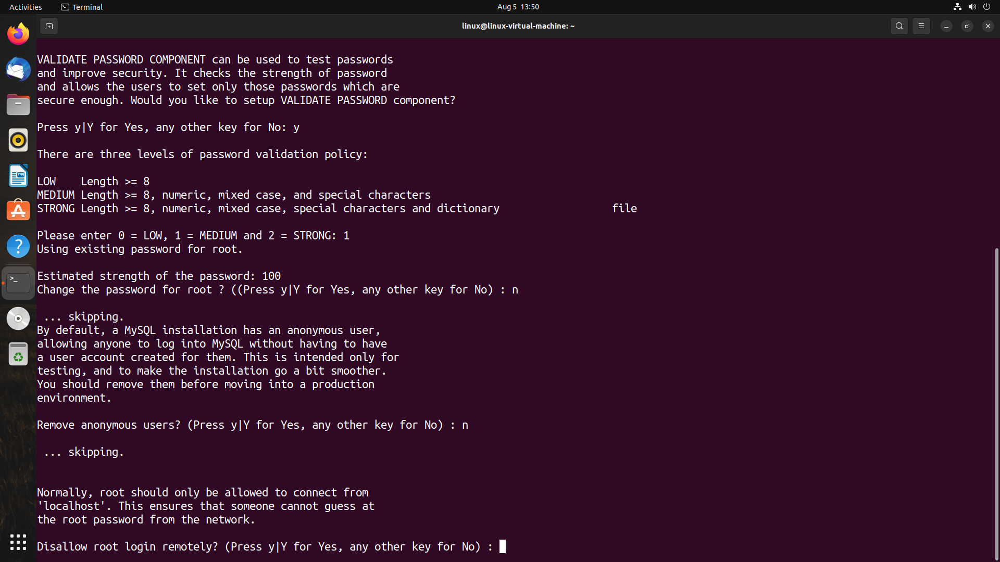

    + We are not using MySQL remotely right now, so we can disallow login MySQL remotely. Type in 'y' and continue.

    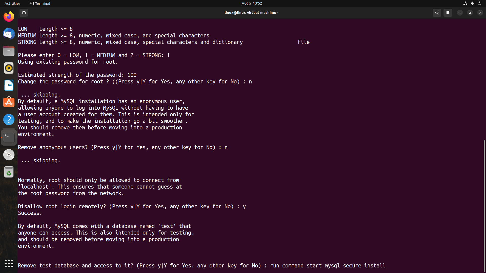

    + As stated before, we are in testing environment right now, so no need to remove the test database. Type in 'n' for no and continue.


    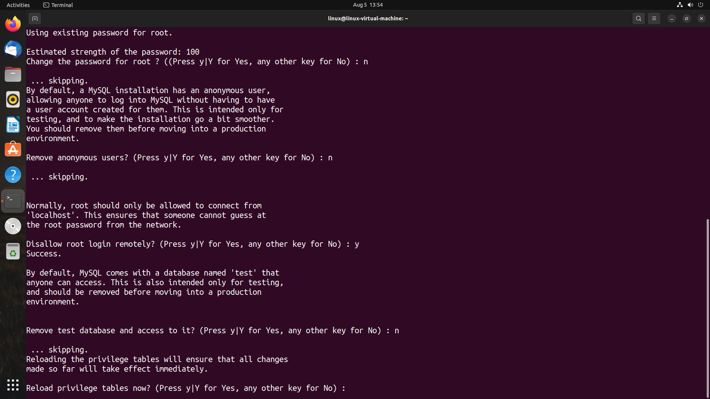

    + We will reload privileges table, as suggested by MySQL Installation. Type in 'y' and continue.

    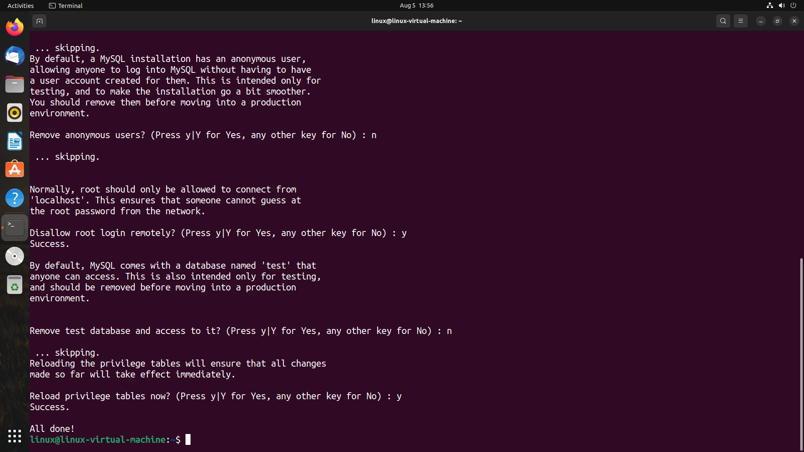

    When it show line `All done!`, you have successfully install MySQL 8.0.

## PHP

- Step 1: Install dependency package using this command:
```shell
sudo apt install -y lsb-release gnupg2 ca-certificates apt-transport-https software-properties-common
```

- Step 2: Add Surý PHP repository by using command:
```shell
add-apt-repository ppa:ondrej/php
```
DO press 'ENTER' when asked.
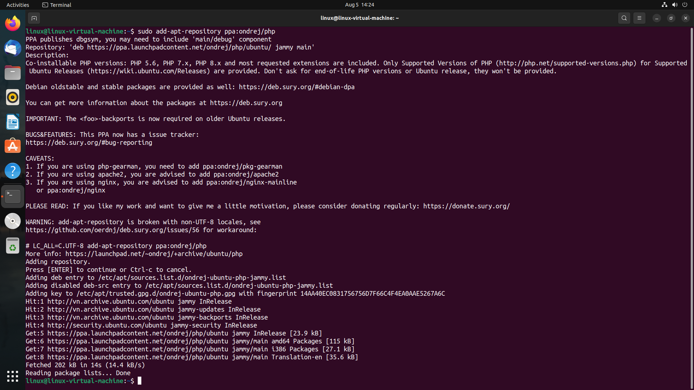
- Step 3: Install PHP 8.2 using command:
```shell
sudo apt install php8.2
```
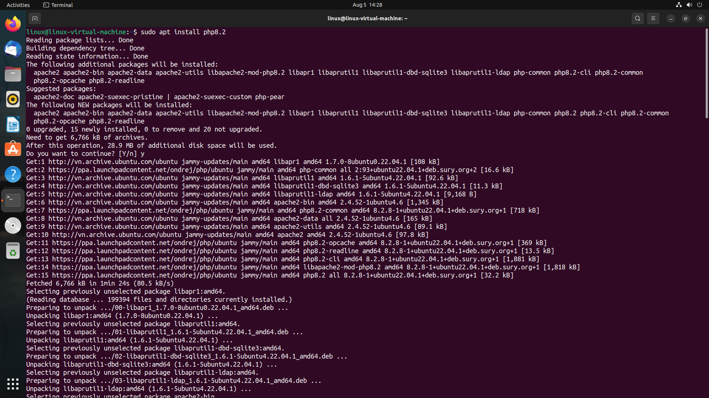
Check PHP installed successfully by using command:
```shell
php -v
```
If it show like in the screen below, you install PHP successfully.
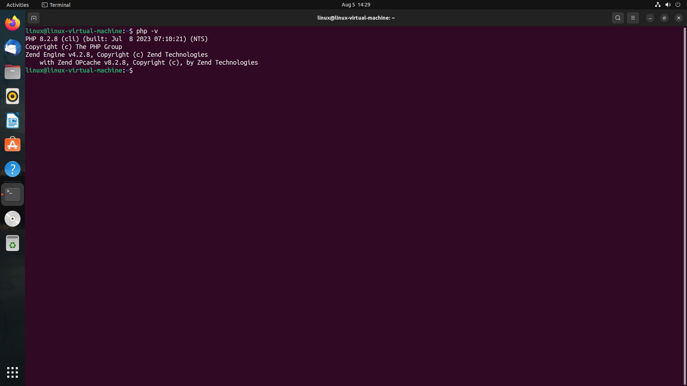
- Step 4: Install PHP modules (for Laravel framework setup) by using command:
```shell
sudo apt install -y php-gd php-mbstring php-xml php-zip php-curl
```
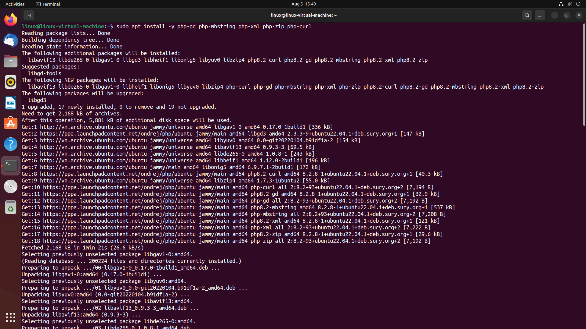
Check modules installes by using command:
```shell
php -m
```
If there existed modules marked in yellow, you installed PHP modules above successfully. If there missing any, please run command above and try again.

